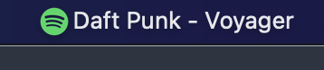
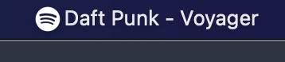

# Spotify Mini Player

Menu bar app which shows currently playing song on Spotify:

Playing: 



Paused:



Click on the bar toggles the playback. It is also possible to setup shortcuts to play next/previous track and toggle the playback - see below.

# Installation

 - install [Hammerspoon](http://www.hammerspoon.org/) - a powerfull automation tool for OS X
   - Manually:

      Download the [latest release](), and drag Hammerspoon.app from your Downloads folder to Applications.
   - Homebrew:

      ```brew install hammerspoon --cask```

 - download [gitlab-merge-requests.spoon](https://github.com/fork-my-spoons/gitlab-merge-requests.spoon/raw/master/gitlab-merge-requests.spoon.zip), unzip and double click on a .spoon file. It will be installed under `~/.hammerspoon/Spoons` folder.
 
 - open ~/.hammerspoon/init.lua and add the following snippet, adding your parameters:

```lua
-- Spotify current song
hs.loadSpoon("spotify-current-song")
spoon['spotify-current-song']:start()
spoon['spotify-current-song']:bindHotkeys(
  {
    next={{"alt"}, "."},
    prev={{"alt"}, ","},
    playpause={{"alt"}, "/"}
  }
)
```

The config above sets up the ollowing shortcuts:

 - <kbd>⌥</kbd> + <kbd>,</kbd> - play next track
 - <kbd>⌥</kbd> + <kbd>.</kbd> - play previous track
 - <kbd>⌥</kbd> + <kbd>/</kbd> - play/pause
